# Machine Learning–Based Late Delivery Risk Prediction in Global Supply Chain Operations


## Project Description

APL Logistics processes hundreds of thousands of orders across global markets, and every late delivery carries a compounding cost — SLA penalties, last-minute rerouting expenses, and lasting damage to customer relationships. The organization had rich historical data on orders, routes, and customer segments, but that data was used almost entirely to explain delays *after* they happened.

This project closes that gap. It builds a machine learning pipeline that scores every order **before dispatch** with a probability of late delivery, classifies it into a Low / Medium / High risk tier, and surfaces the result through a live operations dashboard — turning delay management from a reactive, after-the-fact exercise into a proactive, pre-shipment one.

## Live Demo

🔗 **Streamlit Application:** https://apl-logistics-dashboard.streamlit.app/

## Table of Contents

- [Business Problem](#business-problem)
- [Project Objectives](#project-objectives)
- [Project Workflow](#project-workflow)
- [Repository Structure](#repository-structure)
- [Technology Stack](#technology-stack)
- [Dataset Overview](#dataset-overview)
- [Exploratory Data Analysis](#exploratory-data-analysis)
- [Feature Engineering](#feature-engineering)
- [Machine Learning Pipeline](#machine-learning-pipeline)
- [Model Performance](#model-performance)
- [Feature Importance & Explainability](#feature-importance--explainability)
- [Streamlit Dashboard](#streamlit-dashboard)
- [Dashboard Gallery](#dashboard-gallery)
- [Installation](#installation)
- [Running Locally](#running-locally)
- [Live Application](#live-application)
- [Project Documents](#project-documents)
- [Limitations & Future Improvements](#limitations--future-improvements)
- [References](#references)
- [Author](#author)
- [License](#license)

## Business Problem

APL Logistics faces recurring challenges in its global operations:

- Unpredictable shipment delays across markets and shipping modes
- High operational cost from last-minute corrective actions
- Limited ability to prioritize which high-risk orders need attention first

What the organization lacked was not data, but a **forward-looking system** — one that could look at an order before it left the dock and quantify, with a confidence score, whether it was likely to arrive late. Existing reporting explained delays after the fact; it could not tell operations teams which orders in tomorrow's queue needed intervention today.

The specific question this project answers: **Which orders are at risk of late delivery before they ship, and what is driving that risk?**

Reactive delay management — the prior state — typically means expedited shipping costs, customer service escalations, and penalties that arrive only after the damage is done. A 2023 McKinsey analysis estimated that this reactive approach adds 15–25% to total logistics costs for large 3PL operators, underscoring the financial upside of shifting to a proactive model.

## Project Objectives

- Build a predictive system that flags late-delivery risk before shipment
- Generate a quantitative, 0–1 risk score for every order, bucketed into Low / Medium / High risk tiers
- Provide explainable insights into *why* an order is flagged, to support operational trust
- Deliver a live operations dashboard that turns risk scores into a prioritized, actionable queue

## Project Workflow

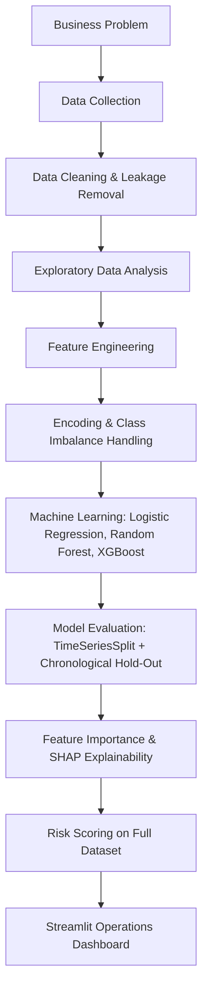

## Repository Structure

```
Machine-Learning-Based-Late-Delivery-Risk-Prediction-in-Global-Supply-Chain-Operations/
│
├── assets/
│   └── logo.png
│
├── dashboard_screenshots/
│   ├── Delay_Risk_Overview_1.png
│   ├── Delay_Risk_Overview_2.png
│   ├── Delay_Risk_Overview_3.png
│   ├── Operations_Action_Panel.png
│   ├── Order_Level_Risk_Predictor_1.png
│   ├── Order_Level_Risk_Predictor_2.png
│   ├── Region_&_Mode_Risk_Analysis_1.png
│   └── Region_&_Mode_Risk_Analysis_2.png
│
├── data/
│
├── docs/
│   ├── APL_Logistics_Executive_Summary.docx
│   ├── APL_Logistics_PRD.odt
│   └── APL_Logistics_Research_Paper.docx
│
├── models/
│
├── plots/
│   ├── 01_eda_overview.png
│   ├── 02_cv_stability.png
│   ├── 03_roc_pr_curves.png
│   ├── 03_roc_pr_curves_1.png
│   ├── 03_roc_pr_curves_2.png
│   ├── 04_confusion_matrices.png
│   ├── 05_rf_importance.png
│   ├── 06_shap_bar.png
│   ├── 07_shap_beeswarm.png
│   └── 08_prob_dist_all_orders.png
│
├── .gitattributes
├── .gitignore
├── APL_Logistics.csv
├── APL_Logistics_PRD.odt
├── APL_Logistics_Research_Paper.docx
├── app.py
├── data_processing.py
├── encoders.py
└── notebook.ipynb
```

## Technology Stack

| Category | Tools / Libraries |
| --- | --- |
| Language | Python |
| Data Handling | pandas, NumPy |
| Machine Learning | scikit-learn (Logistic Regression, Random Forest), XGBoost |
| Imbalance Handling | imbalanced-learn (SMOTE, `ImbPipeline`) |
| Custom Encoding | Custom `SmoothedTargetEncoder` (m-estimate target encoding) |
| Explainability | SHAP |
| Visualization (analysis) | Matplotlib, Seaborn |
| Visualization (dashboard) | Plotly (Express & Graph Objects) |
| Model Persistence | joblib |
| Web Application | Streamlit |
| Deployment | Streamlit Community Cloud |

## Dataset Overview

- **Total records:** 180,519 historical shipment orders from APL Logistics' global operations
- **Original feature columns:** 40
- **Target variable:** `Late_delivery_risk` — a binary indicator (1 = the actual shipping duration exceeded the scheduled duration, 0 = otherwise)
- **Class balance:** approximately 54% of orders are labeled late and 46% on time
- **Source:** APL Logistics historical order records (dataset made available via the project's Google Drive link in the PRD)

Raw fields fall into six natural groups: **Financial** (discounts, product price, profit/benefit), **Logistics** (scheduled shipping duration, shipping mode, delivery status), **Geographic** (customer/order city, state, country, market region), **Order Detail** (item quantity, order total, category identifiers), plus **post-delivery fields** and **PII/identifier fields**, both of which were removed prior to modeling (see [Feature Engineering](#feature-engineering)).

> **Note:** The `Late_delivery_risk` label reflects internal schedule slippage (actual vs. scheduled shipping duration), not a customer-facing SLA breach. It is correlated with, but not identical to, customer-visible delays — see [Limitations](#limitations--future-improvements).

## Exploratory Data Analysis

Missing values were limited to two categorical columns — `Customer Zipcode` and `Customer Lname` — both imputed with a constant "Unknown" placeholder. No duplicate records were identified in the dataset.

`Order Item Profit Ratio` showed a pronounced left-skewed distribution, indicating a meaningful share of heavily discounted orders. No transformation was applied to it, since the tree-based models used downstream are largely insensitive to feature scale and distribution shape.

<p align="center">
  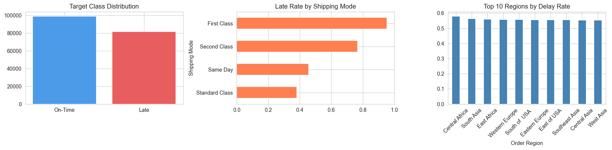
</p>

*Figure: Exploratory overview of the dataset's key distributions.*

## Feature Engineering

Six post-delivery columns (`Days for shipping (real)`, `Delivery Status`, `Order Status`, `Order Profit Per Order`, `Order Item Profit Ratio`, and a derived `shipping_gap` column) were removed as **data leakage** — they are only known after delivery and would be unavailable at scoring time. Nine PII/identifier columns (names, street, zip code, customer/order IDs, product name, latitude, longitude) were also dropped, either for carrying no predictive signal or, in the case of `Product Name`, for excessive cardinality.

On top of the cleaned data, eleven engineered features were constructed:

| Feature | Construction | Rationale |
| --- | --- | --- |
| `shipping_pressure` | Quantity / (Scheduled Days + 1) | Captures the volume–timeline interaction in a single number |
| `schedule_tight` | Binary: scheduled days below training median | Flags the most time-constrained orders |
| `is_express` | Binary: mode contains "Express" | Proxy for lower-risk expedited shipping |
| `order_value_per_qty` | Order Item Total / (Quantity + 1) | Revenue-per-unit signal |
| `discount_pressure` | Order Item Discount Rate | Margin-pressure signal |
| `benefit_ratio` | Benefit per order / (Sales per customer + 1) | Profitability proxy |
| `order_value_tier` | Quintile bin of Order Item Total (from training set) | Captures non-linear value effects |
| `high_quantity_flag` | Binary: quantity above training median | Flags oversized orders |
| `route_key` | Market + "_" + Shipping Mode, then target-encoded | Captures market–mode-specific delay risk |

All fitted statistics (medians, quintile cut points, target-encoding maps) were computed on the training split only and then applied to the test split, to avoid leaking test-set information into the model.

## Machine Learning Pipeline

The pipeline was built around a single guiding principle: any transformation that depends on training labels — encoding, imputation statistics, class balancing — must be fit on training data only and then applied to test data using those stored estimates.

**Preprocessing & Encoding**
- High-cardinality columns (`Order Region`, `Market`, `Order Country`, `route_key`) were encoded with a custom smoothed **m-estimate target encoder** (`encoders.py`), with smoothing weight `m = 20` and unseen categories defaulting to the global training mean.
- Low-cardinality columns (`Shipping Mode`, `Customer Segment`) were one-hot encoded via `pandas.get_dummies`, with the test set reindexed to the training column space to avoid unseen-feature errors.

**Class Imbalance Handling**
- SMOTE was applied inside an `imbalanced-learn` `ImbPipeline`, so synthetic samples are generated from training folds only during cross-validation — preventing the leakage that occurs when SMOTE is applied before the train/test split.
- For XGBoost, `scale_pos_weight` was additionally set from the training class ratio, complementing SMOTE by adjusting the model's own optimization behavior rather than the data distribution.

**Models Trained**
- **Logistic Regression** — baseline, `class_weight='balanced'`, `C=0.5`, with `StandardScaler` for stable convergence
- **Random Forest** — 300 trees, `max_depth=12`, `min_samples_leaf=5` (tuned to prevent overfitting on small regional combinations)
- **XGBoost** — 300 estimators, `max_depth=6`, `learning_rate=0.05`, `subsample`/`colsample_bytree=0.8`, `scale_pos_weight` from training class ratio

**Evaluation**
- Primary metric: **ROC-AUC**, since the operational objective is ranking orders by risk rather than a single fixed cutoff
- Validation used **TimeSeriesSplit** with five folds, preserving temporal order (train on the past, validate on the future)
- Final evaluation was run on a **chronological hold-out set** — the most recent 20% of orders (~36,000 rows) — which the model never saw during training or validation

## Model Performance

**Random Forest** was selected as the production model, achieving the strongest performance on the chronological hold-out test set.

| Metric | Value |
| --- | --- |
| ROC-AUC | 0.7435 |
| Precision (at threshold 0.35) | 0.627 |
| Recall (at threshold 0.35) | 0.816 |
| F1 Score (at threshold 0.35) | 0.709 |
| Orders flagged (at threshold 0.35) | 71.8% |

**Threshold sensitivity** (Random Forest, chronological test set):

| Threshold | Precision | Recall | F1 Score | Orders Flagged |
| --- | --- | --- | --- | --- |
| 0.25 | 0.553 | 0.995 | 0.711 | 99.2% |
| 0.30 | 0.570 | 0.948 | 0.712 | 91.7% |
| **0.35 ◀ selected** | **0.627** | **0.816** | **0.709** | **71.8%** |
| 0.40 | 0.734 | 0.652 | 0.690 | 49.0% |
| 0.45 | 0.790 | 0.592 | 0.677 | 41.3% |
| 0.50 | 0.827 | 0.564 | 0.671 | 37.6% |

The 0.35 threshold was chosen deliberately to prioritize recall — capturing the large majority of true late deliveries — at the cost of a larger, but still manageable, review queue.

**Fleet-level KPIs**, after scoring all 180,519 orders:

| KPI | Value |
| --- | --- |
| Total scored orders | 180,519 |
| Average risk probability | 52.6% |
| High-risk orders (>0.60) | 63,536 (35.2%) |
| Medium-risk orders (0.30–0.60) | 99,083 (54.9%) |
| Low-risk orders (<0.30) | 17,900 (9.9%) |

<details>
<summary><b>Cross-validation, ROC/PR curves, and confusion matrix (click to expand)</b></summary>

<p align="center">
  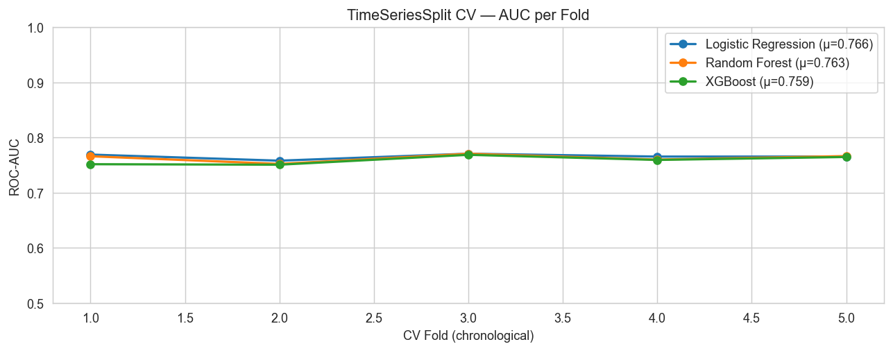<br>
  <em>Figure: TimeSeriesSplit cross-validation AUC stability across folds.</em>
</p>

<p align="center">
  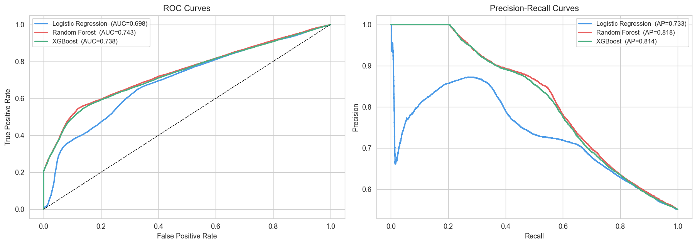<br>
  <em>Figure: ROC and Precision–Recall curves on the chronological hold-out set.</em>
</p>

<p align="center">
  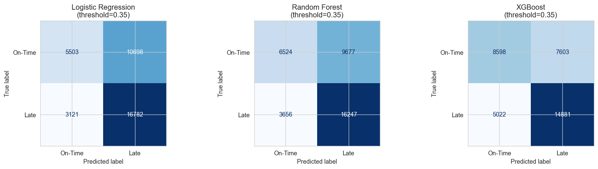<br>
  <em>Figure: Confusion matrices at the operational threshold of 0.35.</em>
</p>

<p align="center">
  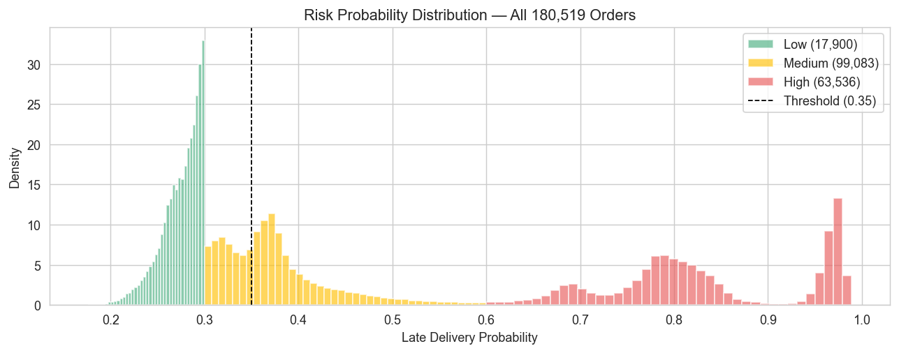<br>
  <em>Figure: Predicted risk probability distribution across all 180,519 scored orders, by category.</em>
</p>

</details>

## Feature Importance & Explainability

Feature attribution combined Gini importance from the fitted Random Forest with **SHAP values**, used as the primary basis for interpretation since Gini importance can be biased toward high-cardinality features.

The most influential predictors of delay risk are:

1. **Days for shipment (scheduled)** — the strongest single driver; shorter schedules leave minimal buffer
2. **shipping_pressure** — the interaction of order size and schedule tightness
3. **region_risk_score** — the smoothed historical delay rate by region
4. **Shipping Mode** — Standard Class consistently shows higher delay risk than Express or Same Day
5. **order_value_tier** — higher-value orders show a slightly lower delay probability

Lower-impact features include `discount_pressure`, `benefit_ratio`, and `Customer Segment` (minimal incremental signal).

SHAP also enables **order-level explanations** — decomposing a single prediction into its contributing factors rather than presenting an isolated score. A typical high-risk order combines high shipping pressure, a short scheduled delivery window, and an elevated route/region risk score.

<details>
<summary><b>SHAP visualizations (click to expand)</b></summary>

<p align="center">
  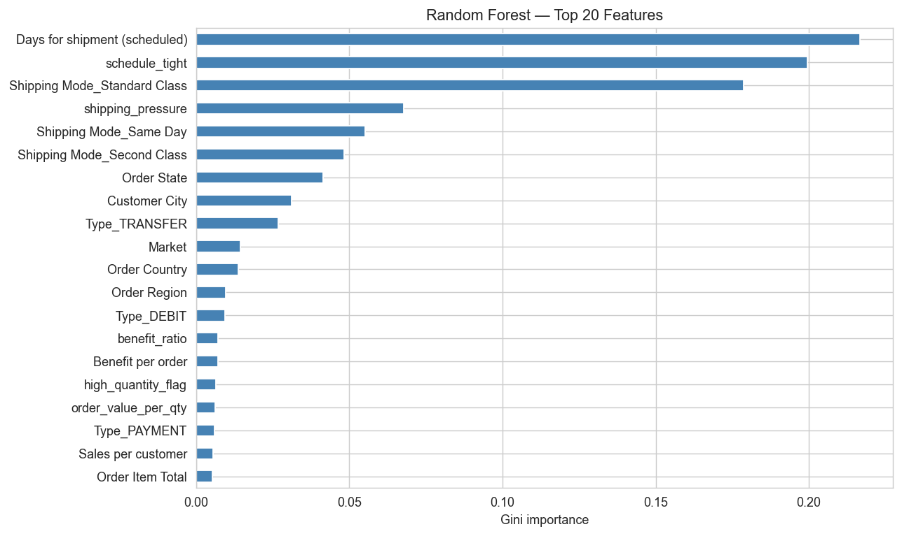<br>
  <em>Figure: Random Forest Gini feature importance.</em>
</p>

<p align="center">
  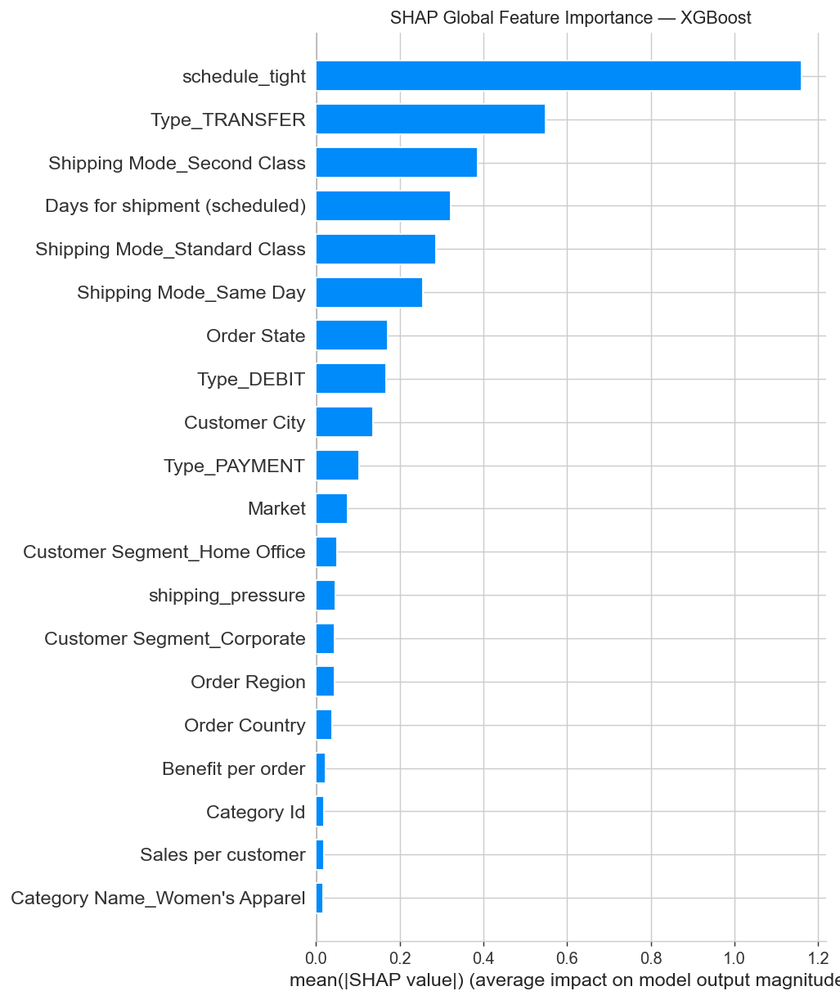<br>
  <em>Figure: SHAP global feature importance, ordered by mean |SHAP value|.</em>
</p>

<p align="center">
  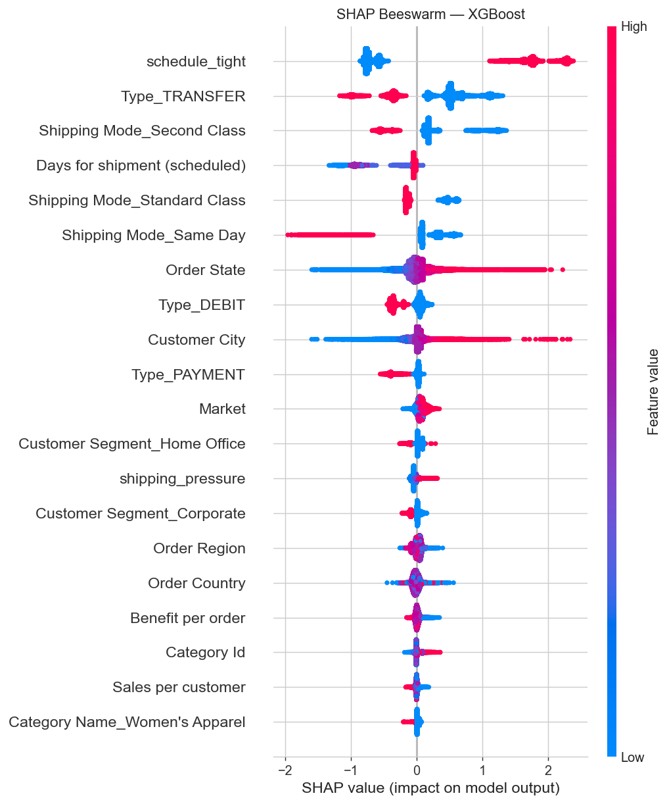<br>
  <em>Figure: SHAP beeswarm plot — red increases risk, blue decreases risk.</em>
</p>

</details>

## Streamlit Dashboard

The trained pipeline is deployed as a four-tab Streamlit application (`app.py`), with global filters (risk threshold, shipping mode, region/market, customer segment, and data split) available in the sidebar across all tabs.

- **Delay Risk Overview** — overall risk distribution across the fleet and high-risk order counts
- **Order-Level Risk Prediction** — an interactive form to score a new order (shipping mode, quantity, scheduled days, region, segment, market, order value, discount rate, benefit, and sales) and view sample high-risk orders from the test set
- **Region & Mode Risk Analysis** — a regional risk heatmap, a shipping mode risk comparison, and a combined region × shipping-mode risk matrix
- **Operations Action Panel** — a prioritized, filterable attention queue with an adjustable risk threshold and top-N selector, sorted by intervention priority, with a one-click **CSV export** of the flagged queue

## Dashboard Gallery

<p align="center">
  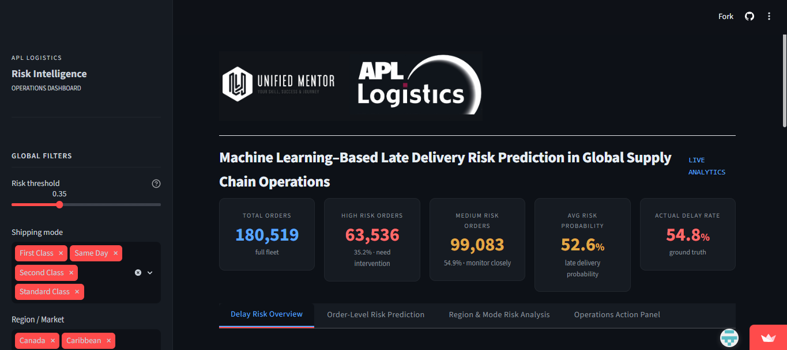<br>
  <em>Delay Risk Overview — fleet-wide risk distribution.</em>
</p>

<p align="center">
  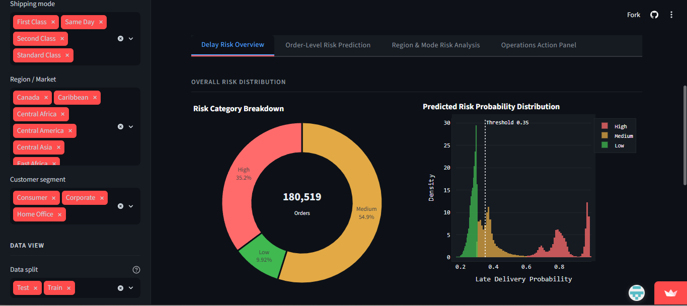<br>
  <em>Delay Risk Overview — risk by key dimensions.</em>
</p>

<p align="center">
  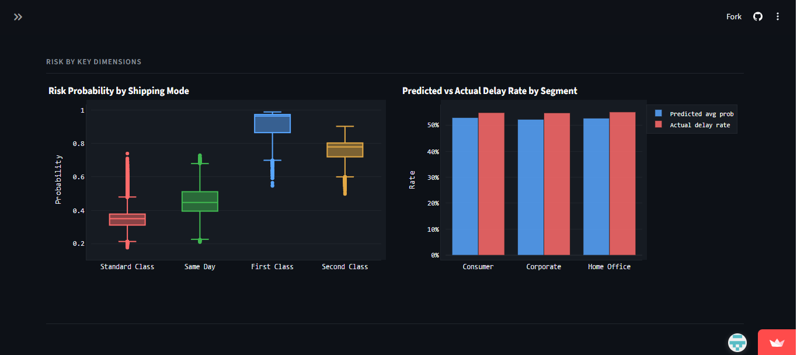<br>
  <em>Delay Risk Overview — additional distribution views.</em>
</p>

<p align="center">
  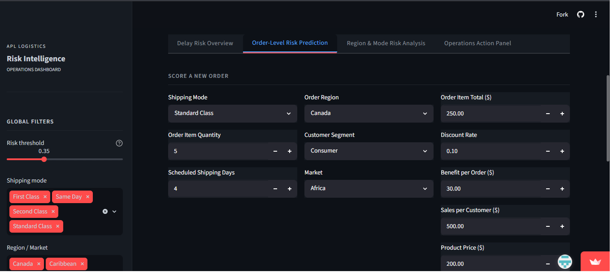<br>
  <em>Order-Level Risk Prediction — scoring form for a new order.</em>
</p>

<p align="center">
  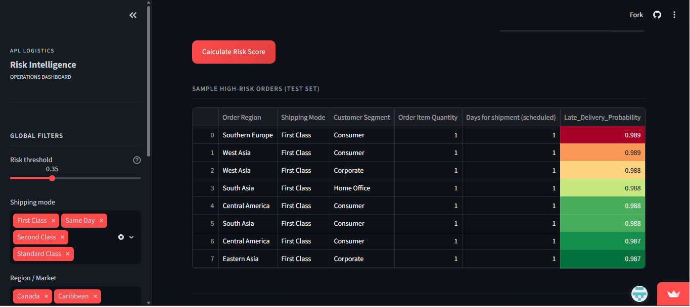<br>
  <em>Order-Level Risk Prediction — sample high-risk orders from the test set.</em>
</p>

<p align="center">
  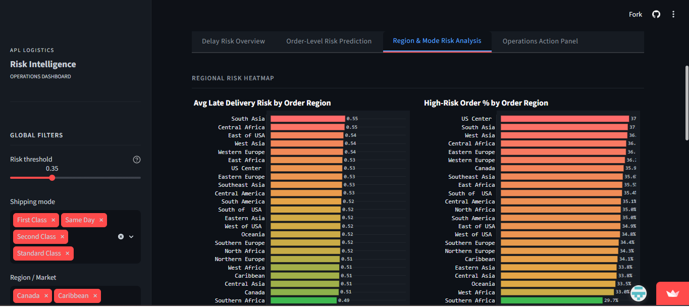<br>
  <em>Region & Mode Risk Analysis — regional risk heatmap.</em>
</p>

<p align="center">
  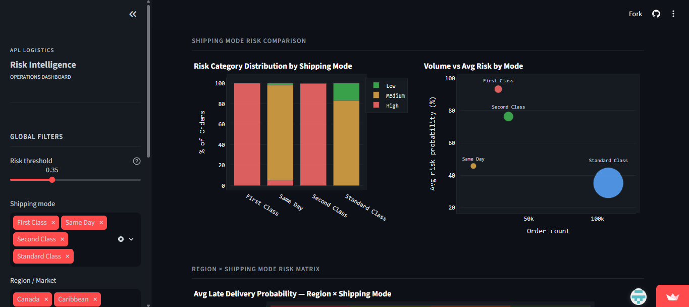<br>
  <em>Region & Mode Risk Analysis — shipping mode and region × mode risk matrix.</em>
</p>

<p align="center">
  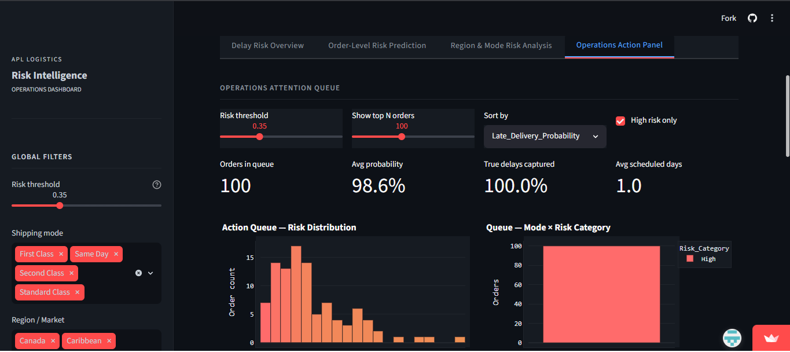<br>
  <em>Operations Action Panel — prioritized action queue with CSV export.</em>
</p>

## Installation

1. Clone the repository:
   ```bash
   git clone https://github.com/amrit1426/Machine-Learning-Based-Late-Delivery-Risk-Prediction-in-Global-Supply-Chain-Operations.git
   cd Machine-Learning-Based-Late-Delivery-Risk-Prediction-in-Global-Supply-Chain-Operations
   ```

2. (Recommended) Create and activate a virtual environment:
   ```bash
   python -m venv venv
   source venv/bin/activate      # On Windows: venv\Scripts\activate
   ```

3. Install the core dependencies used by the pipeline and dashboard:
   ```bash
   pip install pandas numpy scikit-learn xgboost imbalanced-learn shap matplotlib seaborn joblib streamlit plotly
   ```

## Running Locally

1. **Run the data pipeline** (loads data, cleans it, engineers features, trains models, and saves artifacts to `models/` and `data/`):
   ```bash
   python data_processing.py
   ```

2. **Launch the Streamlit dashboard:**
   ```bash
   streamlit run app.py
   ```

3. Open the local URL Streamlit prints in the terminal (typically `http://localhost:8501`) in your browser.

> The dashboard (`app.py`) registers `encoders` and `data_processing` in `sys.modules` before loading the saved model artifacts, so that the custom `SmoothedTargetEncoder` class resolves correctly during unpickling regardless of the original pickling environment.

## Live Application

The dashboard is deployed and publicly accessible at:

🔗 **https://apl-logistics-dashboard.streamlit.app/**

## Project Documents

Full supporting documentation is available in the [`docs/`](docs/) folder:

- 📄 [Executive Summary](docs/APL_Logistics_Executive_Summary.docx)
- 📄 [Research Paper](docs/APL_Logistics_Research_Paper.docx)
- 📄 [Project Requirements Document (PRD)](docs/APL_Logistics_PRD.odt)

## Limitations & Future Improvements

**Limitations**

- **Target variable ambiguity:** `Late_delivery_risk` is based on schedule slippage, not a customer-facing SLA breach, so the model predicts internal schedule adherence rather than customer-visible delay directly.
- **Missing predictors:** the feature set does not include route distance, carrier-level performance history, real-time port/customs congestion, or weather data — all plausible sources of further predictive lift.
- **Temporal drift:** the model is trained on fixed historical data with no automated retraining or drift monitoring; production use would require periodic retraining and performance tracking.
- **Causal limitations:** the model captures statistical association, not causation — interventions based on a prediction (e.g., changing shipping mode) can change the very features the prediction was based on.
- **Explainability scope:** SHAP explains feature contributions to a prediction, not whether the underlying relationship is causally correct.

**Future Improvements** (as identified in the project documents)

- Enrich the model with carrier-level performance history, real-time port congestion signals, and weather disruption feeds — particularly to address the ~18% of late deliveries the current model misses
- Schedule quarterly model retraining on the most recent 12–18 months of data, benchmarked against the previous model version before deployment
- Review Standard Class routing policy in high-risk market–mode combinations, independent of the prediction system itself
- Integrate SLA penalty/commitment data to build a more directly customer-facing target variable

## References

- Blagus, R., & Lusa, L. (2015). SMOTE for high-dimensional class-imbalanced data. *BMC Bioinformatics, 16*(1), 1–16.
- Chawla, N. V., Bowyer, K. W., Hall, L. O., & Kegelmeyer, W. P. (2002). SMOTE: Synthetic minority over-sampling technique. *Journal of Artificial Intelligence Research, 16*, 321–357.
- Chen, Y., Zhang, D., & Hu, X. (2021). Temporal leakage in supply chain predictive models: Evidence from e-commerce logistics. *International Journal of Production Economics, 238*, 108–121.
- Joshi, A., Mehta, R., & Singh, P. (2022). Benchmarking gradient boosting methods for logistics delay classification. *Computers & Industrial Engineering, 164*, 107891.
- Lemaître, G., Nogueira, F., & Aridas, C. K. (2017). Imbalanced-learn: A Python toolbox to tackle the curse of imbalanced datasets in machine learning. *Journal of Machine Learning Research, 18*(17), 1–5.
- Lundberg, S. M., & Lee, S. I. (2017). A unified approach to interpreting model predictions. *Advances in Neural Information Processing Systems, 30*, 4765–4774.
- Micci-Barreca, D. (2001). A preprocessing scheme for high-cardinality categorical attributes in classification and prediction problems. *SIGKDD Explorations, 3*(1), 27–32.
- Sharma, V., & Gupta, S. (2020). Feature importance in multi-modal logistics delay prediction: A random forest analysis. *Transportation Research Part E: Logistics and Transportation Review, 142*, 102068.

## Author

**Amrit**
📧 Email: abaruah289@gmail.com
🔗 LinkedIn: https://www.linkedin.com/in/amrit1426
🐙 GitHub: https://github.com/amrit1426

## License

Currently no license has been specified.
